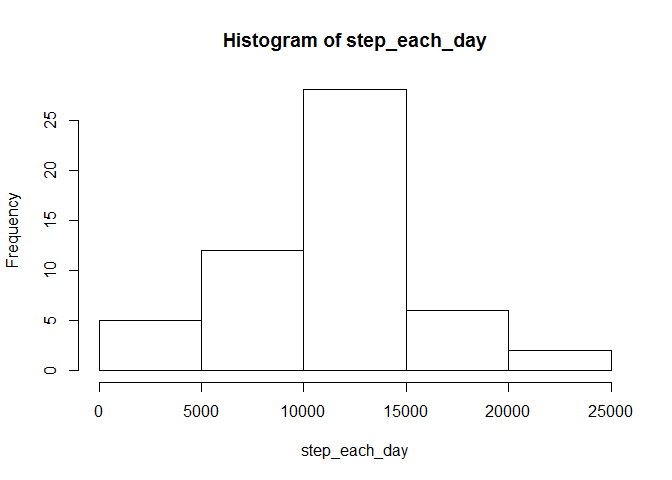
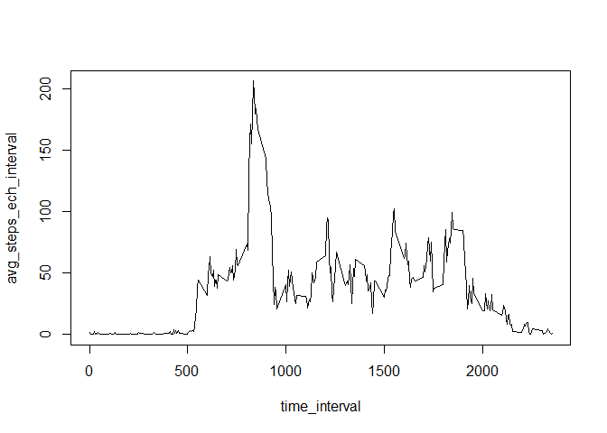
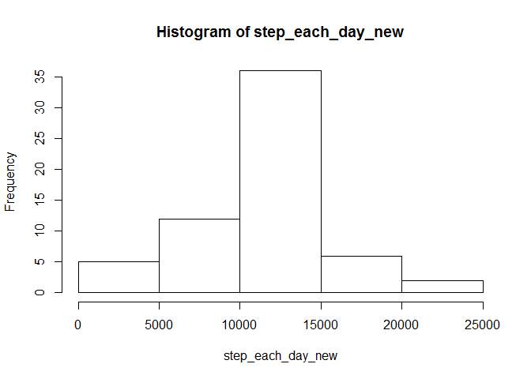

# Reproducible Research: Peer Assessment 1

##Loading and preprocessing the data:
Data is loaded using read.csv
NA elements are eliminated in the pre-processing step

```r
# Loading file
raw_data<-read.csv("activity.csv",header=TRUE,sep=",")

# Preprocessing of data (removing NAs)
pr_data<-na.omit(raw_data)
```
##What is mean total number of steps taken per day

```r
# Histogram of steps each day
step_each_day<-by(pr_data[1],as.Date(pr_data$date),sum)
hist(step_each_day)
```

 

```r
# Mean and median of steps each day
mean_steps_each_day<-mean(step_each_day) #mean 
median_steps_each_day<-median(step_each_day) #median
#Mean
print(mean_steps_each_day)
```

```
## [1] 10766.19
```

```r
#Median
print(median_steps_each_day)
```

```
## 2012-11-12 
##      10765
```
##What is the average daily activity pattern?


```r
# average no of steps in each 5-minute interval
step_each_interval<-by(pr_data[1],pr_data$interval,sum)
number_days<-length(unique(pr_data$date))
avg_steps_ech_interval<-step_each_interval/number_days

# Plot 
x_seq<-seq(1,length(step_each_interval),by = 1)
time_interval<-unique(pr_data$interval)
plot(time_interval,avg_steps_ech_interval,type="l")
```

 

```r
# Max index
max_step_5_min_int<-max(avg_steps_ech_interval)
index_max_step_5_min_int<-which.max(avg_steps_ech_interval)

# Max step number 
max_step_5_min_int
```

```
## [1] 206.1698
```

```r
# Interval for max step number
time_interval[index_max_step_5_min_int]
```

```
## [1] 835
```
##Imputing Missing Values:

1. Finding no of missing data

```r
dim_raw = dim(raw_data)
dim_pr = dim(pr_data)
no_of_missing_values<-dim_raw[1]-dim_pr[1]
```
Number of missing values in the datase

```r
no_of_missing_values
```

```
## [1] 2304
```
2. Filling up missing data and creating new dataset: filled the missing data by mean 5-minute interval data from corresponding interval.

```r
new_raw_data<-raw_data
for(i in 1:dim_raw[1]){
  if(is.na(raw_data$step[i])==TRUE){
    rem<-(i-1)%%288 +1
    new_raw_data[i,1]<-floor(avg_steps_ech_interval[rem])
  }
} 
```
3. Creating New Dataset: The new dataset is created in the previous step.
New dataset name new_raw_data

4. Histogram of no of steps each day with new dataset

```r
step_each_day_new<-by(new_raw_data[1],as.Date(new_raw_data$date),sum)
hist(step_each_day_new)
```

 
Mean and median of steps each day

```r
mean_steps_each_day_new<-mean(step_each_day_new) #mean 
median_steps_each_day_new<-median(step_each_day_new)
#Mean
mean_steps_each_day_new
```

```
## [1] 10749.77
```

```r
#Median
median_steps_each_day_new
```

```
## 2012-11-09 
##      10641
```
Mean and median values differ as compared to the previously calculated data before imputing. The new mean and median values are less due. It may be due to appromimation for using floor function.
